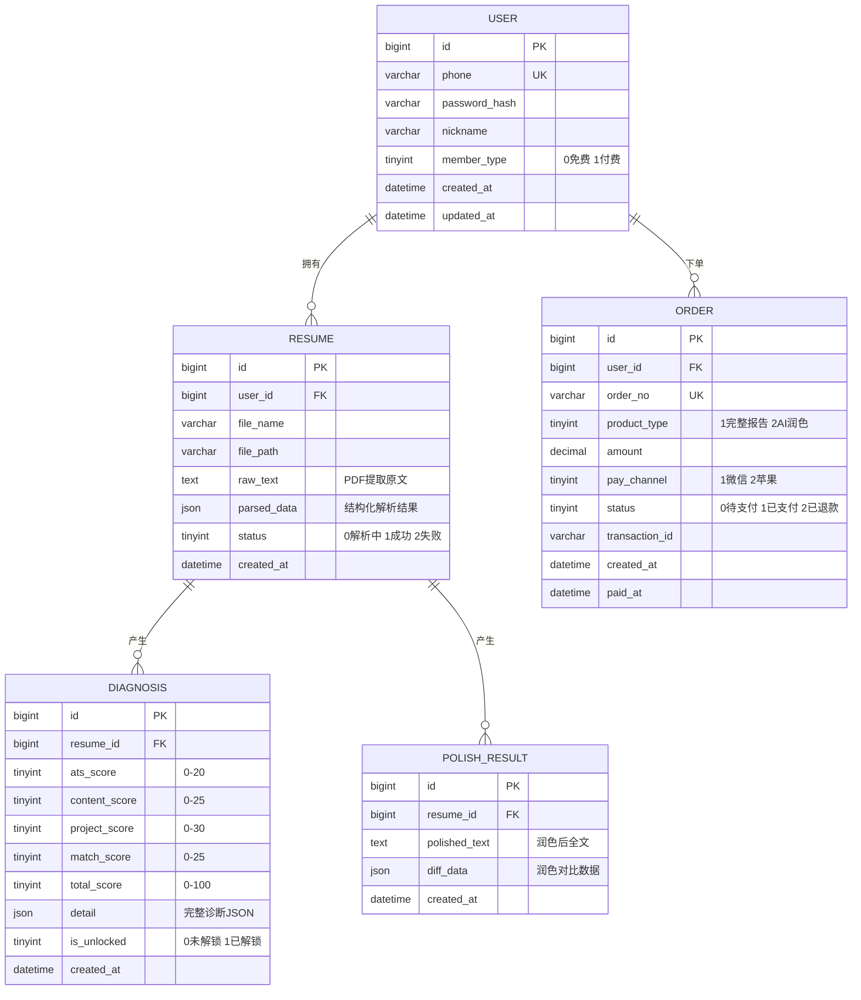
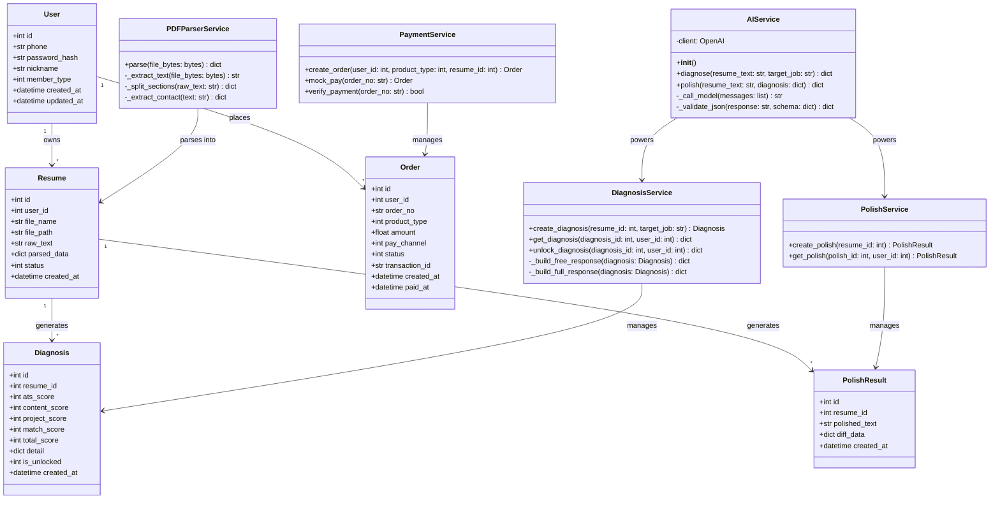
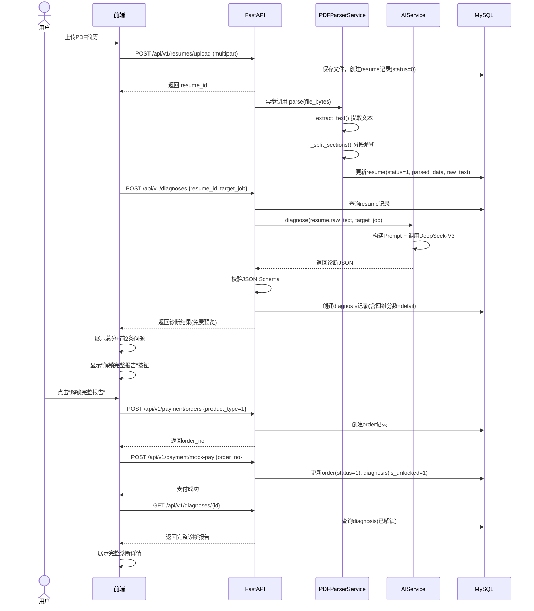
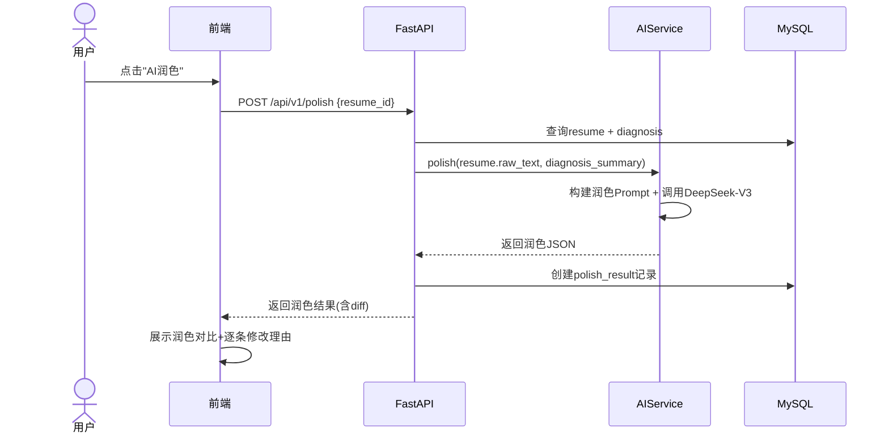
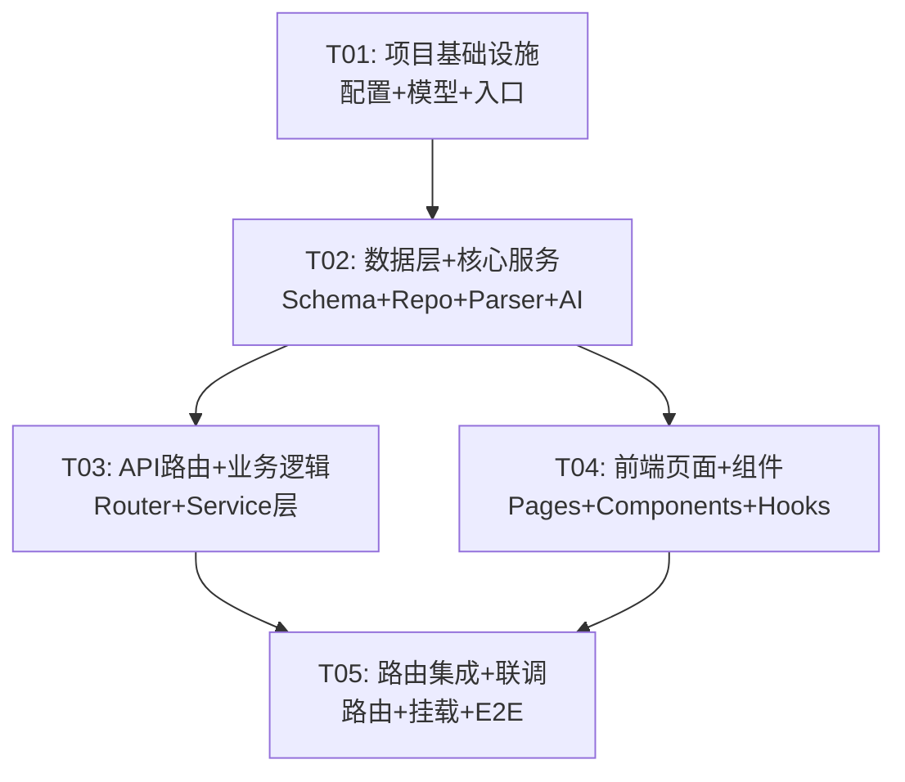

# 简立得 - 系统架构设计文档

> 版本：v1.0 | 日期：2025-07-11 | 作者：架构师 高见远

---

## 目录

1. [实现方案](#1-实现方案)
2. [文件列表](#2-文件列表)
3. [数据库设计](#3-数据库设计)
4. [数据结构与接口](#4-数据结构与接口)
5. [API 接口设计](#5-api-接口设计)
6. [AI Prompt 架构](#6-ai-prompt-架构)
7. [程序调用流程](#7-程序调用流程)
8. [任务分解](#8-任务分解)
9. [共享约定](#9-共享约定)
10. [任务依赖图](#10-任务依赖图)
11. [待明确事项](#11-待明确事项)

---

## 1. 实现方案

### 1.1 核心技术挑战

| 挑战 | 解决方案 |
|------|----------|
| PDF简历解析 | 使用 `pdfplumber` 提取文本，按段落分割，正则识别结构化字段（姓名、电话、邮箱、教育、工作经历等） |
| AI多维度诊断 | 设计结构化Prompt，要求AI返回严格JSON Schema，后端校验后落库 |
| 免费与付费内容分层 | 诊断报告完整存储，免费用户仅返回总分+前2条问题，付费后解锁全量 |
| 微信/苹果支付 | MVP阶段Mock支付接口，预留 `/api/v1/payment/*` 路由，Service层抽象支付网关 |
| AI润色版本管理 | 润色结果独立存储，与原始简历内容关联，支持多版本对比 |

### 1.2 技术栈选型

| 层次 | 技术 | 版本 | 选型理由 |
|------|------|------|----------|
| 后端框架 | FastAPI | ^0.104.0 | 异步高性能，自动生成OpenAPI文档，类型安全 |
| ORM | SQLAlchemy | ^2.0 | Python生态最成熟的ORM，支持异步 |
| 数据库 | MySQL | 8.0 | 关系型数据，事务一致性 |
| 迁移工具 | Alembic | ^1.12.0 | SQLAlchemy官方迁移工具 |
| PDF解析 | pdfplumber | ^0.10.0 | 纯Python，对中文PDF支持好，可提取表格 |
| AI SDK | openai | ^1.3.0 | 兼容硅基流动API，接口统一 |
| 前端框架 | React | ^18.2.0 | 组件化开发，生态成熟 |
| 构建工具 | Vite | ^5.0 | 开发体验好，HMR快 |
| CSS方案 | Tailwind CSS | ^3.4 | 原子化CSS，快速布局 |
| HTTP客户端 | axios | ^1.6.0 | 请求拦截器，错误统一处理 |

### 1.3 架构模式

- **后端**：分层架构（Controller → Service → Repository → Model），依赖注入
- **前端**：组件化 + 自定义Hooks，状态提升到页面组件
- **AI调用**：Service层封装，Prompt模板化管理，流式输出备选

---

## 2. 文件列表

### 2.1 后端文件（`backend/`）

```
backend/
├── requirements.txt                  # Python依赖
├── alembic.ini                       # Alembic配置
├── .env                              # 环境变量
├── app/
│   ├── __init__.py
│   ├── main.py                       # FastAPI应用入口
│   ├── config.py                     # 配置管理（读取.env）
│   ├── database.py                   # 数据库连接与会话
│   ├── models/                       # SQLAlchemy ORM模型
│   │   ├── __init__.py
│   │   ├── user.py                   # 用户模型
│   │   ├── resume.py                 # 简历模型
│   │   ├── diagnosis.py              # 诊断报告模型
│   │   └── order.py                  # 订单模型
│   ├── schemas/                      # Pydantic请求/响应Schema
│   │   ├── __init__.py
│   │   ├── user.py
│   │   ├── resume.py
│   │   ├── diagnosis.py
│   │   └── order.py
│   ├── routers/                      # API路由
│   │   ├── __init__.py
│   │   ├── auth.py                   # 认证相关
│   │   ├── resume.py                 # 简历上传/解析
│   │   ├── diagnosis.py              # 诊断报告
│   │   ├── polish.py                 # AI润色
│   │   └── payment.py                # 支付相关
│   ├── services/                     # 业务逻辑层
│   │   ├── __init__.py
│   │   ├── pdf_parser.py             # PDF解析服务
│   │   ├── ai_service.py             # AI调用封装
│   │   ├── diagnosis_service.py      # 诊断业务逻辑
│   │   ├── polish_service.py         # 润色业务逻辑
│   │   └── payment_service.py        # 支付业务逻辑（MVP Mock）
│   ├── repositories/                 # 数据访问层
│   │   ├── __init__.py
│   │   ├── user_repo.py
│   │   ├── resume_repo.py
│   │   ├── diagnosis_repo.py
│   │   └── order_repo.py
│   └── utils/                        # 工具函数
│       ├── __init__.py
│       └── security.py               # JWT/密码工具
├── migrations/                       # Alembic迁移文件
│   ├── env.py
│   └── versions/
│       └── .gitkeep
└── prompts/                          # Prompt模板
    ├── diagnosis_prompt.py           # 诊断Prompt
    └── polish_prompt.py              # 润色Prompt
```

### 2.2 前端文件（`frontend/`）

```
frontend/
├── package.json                      # NPM依赖
├── vite.config.ts                    # Vite配置
├── tailwind.config.js                # Tailwind配置
├── tsconfig.json                     # TypeScript配置
├── index.html                        # HTML入口
├── postcss.config.js                 # PostCSS配置
├── src/
│   ├── main.tsx                      # React入口
│   ├── App.tsx                       # 根组件+路由
│   ├── vite-env.d.ts                 # Vite类型声明
│   ├── api/                          # API调用层
│   │   ├── client.ts                 # Axios实例配置
│   │   ├── resume.ts                 # 简历相关API
│   │   ├── diagnosis.ts              # 诊断相关API
│   │   └── payment.ts                # 支付相关API
│   ├── components/                   # 通用组件
│   │   ├── Header.tsx                # 顶部导航
│   │   ├── Footer.tsx                # 底部信息
│   │   ├── LoadingSpinner.tsx         # 加载动画
│   │   ├── ScoreRing.tsx             # 环形评分组件
│   │   ├── ScoreBar.tsx              # 条形评分组件
│   │   └── PaywallModal.tsx          # 付费弹窗
│   ├── pages/                        # 页面组件
│   │   ├── HomePage.tsx              # 首页（上传入口）
│   │   ├── UploadPage.tsx            # 上传简历页
│   │   ├── DiagnosisPage.tsx         # 诊断报告页
│   │   └── PolishPage.tsx             # 润色结果页
│   ├── hooks/                        # 自定义Hooks
│   │   ├── useDiagnosis.ts           # 诊断流程Hook
│   │   └── usePayment.ts             # 支付流程Hook
│   ├── types/                        # TypeScript类型
│   │   └── index.ts                  # 全局类型定义
│   └── styles/
│       └── index.css                 # 全局样式+Tailwind导入
```

---

## 3. 数据库设计

### 3.1 ER关系图



### 3.2 建表SQL

```sql
CREATE DATABASE IF NOT EXISTS jianlida DEFAULT CHARSET utf8mb4 COLLATE utf8mb4_unicode_ci;
USE jianlida;

-- 用户表
CREATE TABLE `user` (
    `id` BIGINT NOT NULL AUTO_INCREMENT,
    `phone` VARCHAR(20) NOT NULL COMMENT '手机号',
    `password_hash` VARCHAR(255) NOT NULL COMMENT '密码哈希',
    `nickname` VARCHAR(50) DEFAULT '' COMMENT '昵称',
    `member_type` TINYINT NOT NULL DEFAULT 0 COMMENT '0免费用户 1付费会员',
    `created_at` DATETIME NOT NULL DEFAULT CURRENT_TIMESTAMP,
    `updated_at` DATETIME NOT NULL DEFAULT CURRENT_TIMESTAMP ON UPDATE CURRENT_TIMESTAMP,
    PRIMARY KEY (`id`),
    UNIQUE KEY `uk_phone` (`phone`)
) ENGINE=InnoDB DEFAULT CHARSET=utf8mb4 COMMENT='用户表';

-- 简历表
CREATE TABLE `resume` (
    `id` BIGINT NOT NULL AUTO_INCREMENT,
    `user_id` BIGINT NOT NULL COMMENT '所属用户',
    `file_name` VARCHAR(255) NOT NULL COMMENT '原始文件名',
    `file_path` VARCHAR(500) NOT NULL COMMENT '服务器存储路径',
    `raw_text` TEXT COMMENT 'PDF提取的原文',
    `parsed_data` JSON COMMENT '结构化解析结果',
    `status` TINYINT NOT NULL DEFAULT 0 COMMENT '0解析中 1成功 2失败',
    `created_at` DATETIME NOT NULL DEFAULT CURRENT_TIMESTAMP,
    PRIMARY KEY (`id`),
    KEY `idx_user_id` (`user_id`)
) ENGINE=InnoDB DEFAULT CHARSET=utf8mb4 COMMENT='简历表';

-- 诊断报告表
CREATE TABLE `diagnosis` (
    `id` BIGINT NOT NULL AUTO_INCREMENT,
    `resume_id` BIGINT NOT NULL COMMENT '关联简历',
    `ats_score` TINYINT NOT NULL DEFAULT 0 COMMENT 'ATS通过率得分 0-20',
    `content_score` TINYINT NOT NULL DEFAULT 0 COMMENT '内容质量得分 0-25',
    `project_score` TINYINT NOT NULL DEFAULT 0 COMMENT '项目经历得分 0-30',
    `match_score` TINYINT NOT NULL DEFAULT 0 COMMENT '岗位匹配度得分 0-25',
    `total_score` TINYINT NOT NULL DEFAULT 0 COMMENT '总分 0-100',
    `detail` JSON NOT NULL COMMENT '完整诊断详情JSON',
    `is_unlocked` TINYINT NOT NULL DEFAULT 0 COMMENT '0未解锁 1已解锁',
    `created_at` DATETIME NOT NULL DEFAULT CURRENT_TIMESTAMP,
    PRIMARY KEY (`id`),
    KEY `idx_resume_id` (`resume_id`)
) ENGINE=InnoDB DEFAULT CHARSET=utf8mb4 COMMENT='诊断报告表';

-- 润色结果表
CREATE TABLE `polish_result` (
    `id` BIGINT NOT NULL AUTO_INCREMENT,
    `resume_id` BIGINT NOT NULL COMMENT '关联简历',
    `polished_text` TEXT NOT NULL COMMENT '润色后全文',
    `diff_data` JSON COMMENT '润色对比数据',
    `created_at` DATETIME NOT NULL DEFAULT CURRENT_TIMESTAMP,
    PRIMARY KEY (`id`),
    KEY `idx_resume_id` (`resume_id`)
) ENGINE=InnoDB DEFAULT CHARSET=utf8mb4 COMMENT='润色结果表';

-- 订单表
CREATE TABLE `order` (
    `id` BIGINT NOT NULL AUTO_INCREMENT,
    `user_id` BIGINT NOT NULL COMMENT '下单用户',
    `order_no` VARCHAR(64) NOT NULL COMMENT '订单号',
    `product_type` TINYINT NOT NULL COMMENT '1完整报告 2AI润色',
    `amount` DECIMAL(10,2) NOT NULL COMMENT '金额',
    `pay_channel` TINYINT NOT NULL DEFAULT 1 COMMENT '1微信 2苹果',
    `status` TINYINT NOT NULL DEFAULT 0 COMMENT '0待支付 1已支付 2已退款',
    `transaction_id` VARCHAR(128) DEFAULT '' COMMENT '第三方交易号',
    `resume_id` BIGINT COMMENT '关联简历（解锁哪份报告）',
    `created_at` DATETIME NOT NULL DEFAULT CURRENT_TIMESTAMP,
    `paid_at` DATETIME DEFAULT NULL COMMENT '支付时间',
    PRIMARY KEY (`id`),
    UNIQUE KEY `uk_order_no` (`order_no`),
    KEY `idx_user_id` (`user_id`)
) ENGINE=InnoDB DEFAULT CHARSET=utf8mb4 COMMENT='订单表';
```

---

## 4. 数据结构与接口

### 4.1 类图



### 4.2 前端类型定义

```typescript
// 核心类型
interface DiagnosisResult {
  id: number;
  resumeId: number;
  totalScore: number;
  atsScore: number;
  contentScore: number;
  projectScore: number;
  matchScore: number;
  detail: DiagnosisDetail | null; // null when not unlocked
  isUnlocked: boolean;
}

interface DiagnosisDetail {
  ats: {
    score: number;
    maxScore: number;
    issues: Issue[];
    suggestions: string[];
  };
  content: {
    score: number;
    maxScore: number;
    issues: Issue[];
    suggestions: string[];
  };
  project: {
    score: number;
    maxScore: number;
    issues: Issue[];
    suggestions: string[];
  };
  match: {
    score: number;
    maxScore: number;
    issues: Issue[];
    suggestions: string[];
  };
}

interface Issue {
  severity: 'critical' | 'warning' | 'info';
  field: string;
  description: string;
}

interface PolishResult {
  id: number;
  resumeId: number;
  polishedText: string;
  diffData: DiffItem[];
}

interface DiffItem {
  original: string;
  polished: string;
  reason: string;
}

interface OrderInfo {
  orderNo: string;
  productType: 1 | 2;
  amount: number;
  status: 0 | 1 | 2;
  createdAt: string;
}
```

---

## 5. API 接口设计

所有接口统一响应格式：

```json
{
  "code": 0,
  "message": "success",
  "data": {}
}
```

### 5.1 认证模块

#### POST `/api/v1/auth/register`

注册（手机号+密码）

| 参数 | 类型 | 必填 | 说明 |
|------|------|------|------|
| phone | string | 是 | 手机号 |
| password | string | 是 | 密码（6-20位） |

**响应 data**：
```json
{
  "id": 1,
  "phone": "13800138000",
  "nickname": "",
  "token": "eyJhbGciOiJIUzI1NiIs..."
}
```

#### POST `/api/v1/auth/login`

登录

| 参数 | 类型 | 必填 | 说明 |
|------|------|------|------|
| phone | string | 是 | 手机号 |
| password | string | 是 | 密码 |

**响应 data**：同注册

---

### 5.2 简历模块

#### POST `/api/v1/resumes/upload`

上传简历PDF

| 参数 | 类型 | 必填 | 说明 |
|------|------|------|------|
| file | file | 是 | PDF文件（<5MB） |

**请求格式**：`multipart/form-data`

**响应 data**：
```json
{
  "id": 1,
  "fileName": "张三_前端开发.pdf",
  "status": 0,
  "parsedData": null
}
```

> 注：上传后异步解析，前端轮询或WebSocket通知

#### GET `/api/v1/resumes/{resume_id}`

获取简历详情（含解析结果）

**响应 data**：
```json
{
  "id": 1,
  "fileName": "张三_前端开发.pdf",
  "status": 1,
  "parsedData": {
    "name": "张三",
    "phone": "13800138000",
    "email": "zhangsan@example.com",
    "education": [...],
    "workExperience": [...],
    "projects": [...],
    "skills": [...]
  }
}
```

#### GET `/api/v1/resumes`

获取当前用户的简历列表

**响应 data**：
```json
{
  "items": [
    { "id": 1, "fileName": "张三_前端开发.pdf", "status": 1, "createdAt": "2025-07-11T10:00:00Z" }
  ],
  "total": 1
}
```

---

### 5.3 诊断模块

#### POST `/api/v1/diagnoses`

发起诊断

| 参数 | 类型 | 必填 | 说明 |
|------|------|------|------|
| resume_id | int | 是 | 简历ID |
| target_job | string | 否 | 目标岗位（提升匹配度准确度） |

**响应 data**：
```json
{
  "id": 1,
  "resumeId": 1,
  "totalScore": 62,
  "atsScore": 14,
  "contentScore": 16,
  "projectScore": 18,
  "matchScore": 14,
  "isUnlocked": false,
  "freePreview": {
    "totalScore": 62,
    "topIssues": [
      { "severity": "critical", "field": "ats_format", "description": "简历包含表格和图片，可能导致ATS系统解析失败" },
      { "severity": "warning", "field": "project_quantify", "description": "项目描述缺少量化成果，建议补充具体数据和指标" }
    ]
  },
  "detail": null,
  "createdAt": "2025-07-11T10:05:00Z"
}
```

#### GET `/api/v1/diagnoses/{diagnosis_id}`

获取诊断报告

- **未解锁**：仅返回 `totalScore` + `freePreview`
- **已解锁**：返回完整 `detail`

**响应 data**：同上结构，`detail` 字段在已解锁时非null

---

### 5.4 润色模块

#### POST `/api/v1/polish`

发起AI润色

| 参数 | 类型 | 必填 | 说明 |
|------|------|------|------|
| resume_id | int | 是 | 简历ID |

**响应 data**：
```json
{
  "id": 1,
  "resumeId": 1,
  "polishedText": "润色后全文...",
  "diffData": [
    {
      "original": "负责前端开发工作",
      "polished": "主导前端架构设计与核心模块开发，推动前端工程化体系建设",
      "reason": "原描述过于笼统，缺乏具体职责和技术深度；润色后突出领导力和技术影响力"
    }
  ]
}
```

#### GET `/api/v1/polish/{polish_id}`

获取润色结果

---

### 5.5 支付模块

#### POST `/api/v1/payment/orders`

创建订单

| 参数 | 类型 | 必填 | 说明 |
|------|------|------|------|
| product_type | int | 是 | 1=完整报告 2=AI润色 |
| resume_id | int | 是 | 关联简历ID |

**响应 data**：
```json
{
  "orderNo": "JLD20250711100500001",
  "productType": 1,
  "amount": 9.90,
  "status": 0,
  "createdAt": "2025-07-11T10:05:00Z"
}
```

#### POST `/api/v1/payment/mock-pay`

Mock支付（仅MVP）

| 参数 | 类型 | 必填 | 说明 |
|------|------|------|------|
| order_no | string | 是 | 订单号 |

**响应 data**：
```json
{
  "orderNo": "JLD20250711100500001",
  "status": 1,
  "paidAt": "2025-07-11T10:05:30Z"
}
```

#### GET `/api/v1/payment/orders/{order_no}`

查询订单状态

---

## 6. AI Prompt 架构

### 6.1 诊断Prompt

```python
DIAGNOSIS_SYSTEM_PROMPT = """你是一位资深简历顾问和ATS系统专家。你需要对用户简历进行多维度专业诊断。

## 评分维度与标准

### 1. ATS通过率（满分20分）
- 是否使用标准格式（无表格、图片、文本框等非ATS友好元素）
- 关键词密度是否合理
- 联系方式是否完整规范
- 字体和排版是否简洁

### 2. 内容质量（满分25分）
- 个人总结是否有亮点和差异化
- 工作经历是否使用STAR法则
- 描述是否有量化数据支撑
- 语言是否精炼专业，无冗余

### 3. 项目经历（满分30分）
- 项目描述是否包含背景、职责、成果三要素
- 是否体现技术深度和业务理解
- 是否有可量化的业绩指标
- 项目与目标岗位的相关性

### 4. 岗位匹配度（满分25分）
- 核心技能匹配度
- 行业/领域经验相关性
- 职级与目标岗位的适配度
- 关键词命中情况

## 输出要求

你必须严格按以下JSON格式输出，不要输出任何其他内容：

```json
{
  "ats": {
    "score": <0-20的整数>,
    "issues": [
      {"severity": "critical|warning|info", "field": "字段标识", "description": "问题描述"}
    ],
    "suggestions": ["改进建议1", "改进建议2"]
  },
  "content": {
    "score": <0-25的整数>,
    "issues": [
      {"severity": "critical|warning|info", "field": "字段标识", "description": "问题描述"}
    ],
    "suggestions": ["改进建议1", "改进建议2"]
  },
  "project": {
    "score": <0-30的整数>,
    "issues": [
      {"severity": "critical|warning|info", "field": "字段标识", "description": "问题描述"}
    ],
    "suggestions": ["改进建议1", "改进建议2"]
  },
  "match": {
    "score": <0-25的整数>,
    "issues": [
      {"severity": "critical|warning|info", "field": "字段标识", "description": "问题描述"}
    ],
    "suggestions": ["改进建议1", "改进建议2"]
  }
}
```

注意：
- issues按严重程度从高到低排列
- 每个维度至少2条issues，最多5条
- 每个维度至少2条suggestions，最多5条
- severity: critical=严重问题（必须修改）, warning=建议优化, info=锦上添花
"""
```

**用户消息模板**：

```python
DIAGNOSIS_USER_TEMPLATE = """请对以下简历进行专业诊断。

## 目标岗位
{target_job}

## 简历内容
{resume_text}

请按四大维度评分并给出详细问题与建议。"""
```

### 6.2 润色Prompt

```python
POLISH_SYSTEM_PROMPT = """你是一位资深简历优化专家。你需要对用户简历进行专业润色改写。

## 润色原则

1. **保持真实性**：不编造经历、数据或技能，只优化表达方式
2. **量化优先**：将模糊描述改为量化表达（如"提升了性能"→"将接口响应时间从2s优化至200ms"）
3. **STAR法则**：确保每条经历包含情境(Situation)、任务(Task)、行动(Action)、结果(Result)
4. **动词驱动**：用强有力的动词开头（主导/设计/优化/推动 vs 负责/参与/协助）
5. **关键词优化**：确保行业核心关键词自然融入
6. **精炼语言**：删除冗余修饰，每条描述控制在1-2行

## 输出要求

你必须严格按以下JSON格式输出，不要输出任何其他内容：

```json
{
  "polished_text": "润色后的完整简历文本",
  "diff_data": [
    {
      "original": "原文片段",
      "polished": "润色后片段",
      "reason": "润色理由"
    }
  ]
}
```

注意：
- diff_data列出所有实质性修改（不含格式调整）
- 每条reason简明扼要，不超过50字
- polished_text必须保持原文的整体结构和段落
"""
```

**用户消息模板**：

```python
POLISH_USER_TEMPLATE = """请对以下简历进行润色优化。

## 原始简历
{resume_text}

## 诊断发现的主要问题
{diagnosis_summary}

请进行润色改写，提升简历的专业性和竞争力。"""
```

### 6.3 AI输出JSON Schema

诊断输出Schema（用于后端校验）：

```python
DIAGNOSIS_OUTPUT_SCHEMA = {
    "type": "object",
    "required": ["ats", "content", "project", "match"],
    "properties": {
        "ats": {
            "type": "object",
            "required": ["score", "issues", "suggestions"],
            "properties": {
                "score": {"type": "integer", "minimum": 0, "maximum": 20},
                "issues": {
                    "type": "array",
                    "items": {
                        "type": "object",
                        "required": ["severity", "field", "description"],
                        "properties": {
                            "severity": {"type": "string", "enum": ["critical", "warning", "info"]},
                            "field": {"type": "string"},
                            "description": {"type": "string"}
                        }
                    }
                },
                "suggestions": {"type": "array", "items": {"type": "string"}}
            }
        },
        "content": {
            "type": "object",
            "required": ["score", "issues", "suggestions"],
            "properties": {
                "score": {"type": "integer", "minimum": 0, "maximum": 25},
                "issues": {"type": "array", "items": {"type": "object"}},
                "suggestions": {"type": "array", "items": {"type": "string"}}
            }
        },
        "project": {
            "type": "object",
            "required": ["score", "issues", "suggestions"],
            "properties": {
                "score": {"type": "integer", "minimum": 0, "maximum": 30},
                "issues": {"type": "array", "items": {"type": "object"}},
                "suggestions": {"type": "array", "items": {"type": "string"}}
            }
        },
        "match": {
            "type": "object",
            "required": ["score", "issues", "suggestions"],
            "properties": {
                "score": {"type": "integer", "minimum": 0, "maximum": 25},
                "issues": {"type": "array", "items": {"type": "object"}},
                "suggestions": {"type": "array", "items": {"type": "string"}}
            }
        }
    }
}
```

---

## 7. 程序调用流程

### 7.1 简历上传与诊断流程



### 7.2 AI润色流程



---

## 8. 任务分解

### 8.1 所需依赖包

**后端（requirements.txt）**：
```
fastapi==0.104.1
uvicorn==0.24.0
sqlalchemy==2.0.23
alembic==1.12.1
pymysql==1.1.0
cryptography==41.0.7
python-dotenv==1.0.0
python-multipart==0.0.6
pdfplumber==0.10.3
openai==1.3.0
pydantic==2.5.2
python-jose==3.3.0
passlib==1.7.4
bcrypt==4.1.2
```

**前端（package.json 核心依赖）**：
```
- react@^18.2.0: UI框架
- react-dom@^18.2.0: DOM渲染
- react-router-dom@^6.20.0: 路由
- axios@^1.6.2: HTTP客户端
- typescript@^5.3.0: 类型系统
- @types/react@^18.2.0: React类型
- @types/react-dom@^18.2.0: ReactDOM类型
- tailwindcss@^3.4.0: CSS框架
- postcss@^8.4.0: CSS处理
- autoprefixer@^10.4.0: 浏览器兼容
- @vitejs/plugin-react@^4.2.0: Vite React插件
- vite@^5.0.0: 构建工具
```

### 8.2 任务列表

| Task ID | 任务名称 | 源文件 | 依赖 | 优先级 |
|---------|---------|--------|------|--------|
| T01 | 项目基础设施 | backend: requirements.txt, .env, alembic.ini, app/main.py, app/config.py, app/database.py, app/models/__init__.py, app/models/user.py, app/models/resume.py, app/models/diagnosis.py, app/models/order.py, migrations/env.py, migrations/versions/.gitkeep; frontend: package.json, vite.config.ts, tailwind.config.js, tsconfig.json, postcss.config.js, index.html, src/main.tsx, src/App.tsx, src/vite-env.d.ts, src/styles/index.css | 无 | P0 |
| T02 | 数据层 + 核心服务 | backend: app/schemas/user.py, app/schemas/resume.py, app/schemas/diagnosis.py, app/schemas/order.py, app/repositories/user_repo.py, app/repositories/resume_repo.py, app/repositories/diagnosis_repo.py, app/repositories/order_repo.py, app/services/pdf_parser.py, app/services/ai_service.py, app/utils/security.py, prompts/diagnosis_prompt.py, prompts/polish_prompt.py; frontend: src/types/index.ts, src/api/client.ts, src/api/resume.ts, src/api/diagnosis.ts, src/api/payment.ts | T01 | P0 |
| T03 | API路由 + 业务逻辑 | backend: app/routers/auth.py, app/routers/resume.py, app/routers/diagnosis.py, app/routers/polish.py, app/routers/payment.py, app/services/diagnosis_service.py, app/services/polish_service.py, app/services/payment_service.py | T02 | P0 |
| T04 | 前端页面 + 组件 | frontend: src/pages/HomePage.tsx, src/pages/UploadPage.tsx, src/pages/DiagnosisPage.tsx, src/pages/PolishPage.tsx, src/components/Header.tsx, src/components/Footer.tsx, src/components/LoadingSpinner.tsx, src/components/ScoreRing.tsx, src/components/ScoreBar.tsx, src/components/PaywallModal.tsx, src/hooks/useDiagnosis.ts, src/hooks/usePayment.ts | T02 | P0 |
| T05 | 路由集成 + 联调 | frontend: src/App.tsx（更新路由配置）, backend: app/main.py（更新CORS和路由挂载）; 联调修复 | T03, T04 | P1 |

---

## 9. 共享约定

### 9.1 命名规范

| 范畴 | 规范 | 示例 |
|------|------|------|
| 后端文件 | snake_case | `diagnosis_service.py` |
| 后端类名 | PascalCase | `DiagnosisService` |
| 后端函数 | snake_case | `create_diagnosis()` |
| 前端文件 | PascalCase | `DiagnosisPage.tsx` |
| 前端组件 | PascalCase | `<ScoreRing />` |
| 前端Hooks | camelCase, use前缀 | `useDiagnosis` |
| API路径 | kebab-case, 复数名词 | `/api/v1/diagnoses` |
| 数据库表 | snake_case, 单数名词 | `diagnosis` |
| 数据库列 | snake_case | `total_score` |
| 环境变量 | UPPER_SNAKE_CASE | `DATABASE_URL` |

### 9.2 API响应格式

```json
{
  "code": 0,
  "message": "success",
  "data": {}
}
```

### 9.3 错误码规范

| 错误码 | 含义 | HTTP状态码 |
|--------|------|-----------|
| 0 | 成功 | 200 |
| 1001 | 参数校验失败 | 422 |
| 1002 | 文件格式不支持 | 400 |
| 1003 | 文件大小超限 | 400 |
| 2001 | 用户未注册 | 401 |
| 2002 | 密码错误 | 401 |
| 2003 | Token过期/无效 | 401 |
| 3001 | 简历不存在 | 404 |
| 3002 | 简历解析失败 | 500 |
| 3003 | 简历解析中 | 202 |
| 4001 | 诊断报告不存在 | 404 |
| 4002 | 报告未解锁 | 403 |
| 5001 | 订单不存在 | 404 |
| 5002 | 订单已支付 | 400 |
| 5003 | 支付失败 | 500 |
| 6001 | AI服务异常 | 500 |
| 6002 | AI响应格式异常 | 500 |
| 9999 | 服务器内部错误 | 500 |

### 9.4 认证规范

- 使用JWT（HS256算法）
- Token有效期：7天
- Header格式：`Authorization: Bearer <token>`
- 登录/注册接口除外，所有接口需验证Token

### 9.5 日期格式

- 存储：UTC时间 `DATETIME`
- 传输：ISO 8601格式 `2025-07-11T10:05:00Z`

### 9.6 文件上传限制

- 仅支持PDF格式
- 文件大小上限：5MB
- 存储路径：`./uploads/{user_id}/{timestamp}_{filename}`

---

## 10. 任务依赖图



---

## 11. 待明确事项

| # | 事项 | 当前假设 | 建议 |
|---|------|---------|------|
| 1 | 目标岗位如何获取？ | 诊断时用户手动输入（可选字段） | 可在首页增加"目标岗位"输入框，也可从用户画像推断 |
| 2 | 免费用户诊断次数限制 | 假设每个用户3次免费诊断 | 产品侧需确认，可在user表增加`free_diagnosis_count`字段 |
| 3 | AI润色是否需要单独付费 | 是，独立于完整报告解锁 | 19.9元/次，与PRD一致 |
| 4 | 简历解析失败的处理 | 返回status=2，提示用户重新上传 | 可增加"手动粘贴简历文本"作为降级方案 |
| 5 | 硅基流动API并发限制 | 假设无特殊限制 | 如有限流需增加队列和重试机制 |
| 6 | 前端部署方式 | MVP阶段本地开发运行 | 后续可部署到云服务（Vercel/腾讯云） |
| 7 | 用户注册方式 | 手机号+密码 | 后续可增加微信登录，需预留OAuth接口 |

---

> **文档结束** — 架构师高见远，如需调整请反馈。
